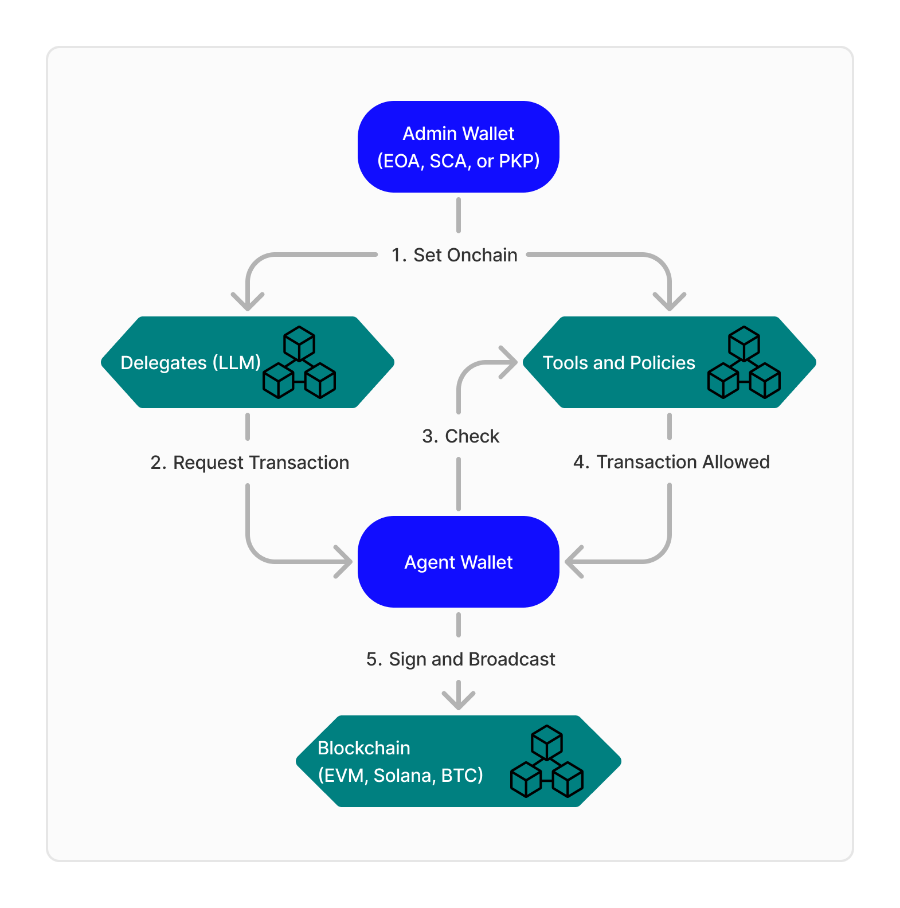

# Agent Wallet Overview

The Lit Agent Wallet (LAW) is a toolkit for enabling designated administrators (individual users, companies, DAOs) to securely delegate wallet operations to permitted "delegatees" (such as AI agents or app developers.) The toolkit is built on top of [Lit Actions](../sdk/serverless-signing/overview.md) and [Programmable Key Pairs (PKPs)](../user-wallets/pkps/overview.md), where Lit Actions are used to set the tools that delegatees can use and define the policies that dictate their permitted behavior, and PKPs for signing operations.

The full repository for the Lit Agent Wallet is available on [GitHub](https://github.com/LIT-Protocol/agent-wallet).

:::info
The root authority of the Agent Wallet is the PKP, which is an ERC-721 token held by the Admin.
:::

## Core Concepts

### Admin
The Admin is the registered owner of a given Agent Wallet and has full control over how it is used and managed. They are responsible for:
- Creating and managing PKPs (Agent Wallets)
- Adding and removing delegatees
- Registering and managing tools
- Setting policies

### Delegatees
Delegatees are entities that Administrators permit to execute specific operations on their behalf using their Agent Wallet. Typically, the "agent" / LLM machine is the delegatee. They:
- Must authenticate using Sign-in With Ethereum (SIWE)
- Can execute tools permitted by the Admin
- Operate within the constraints of policies set by the Admin

### Tools
Tools are the building blocks of Agent Wallet functionality, represented by [Lit Actions](../sdk/serverless-signing/overview.md) published on IPFS. They:
- Must be registered by the Admin
- Enable permitted delegatees to execute specific actions (i.e. performing a token swap or executing a smart contract)
- Execute specific operations on behalf of the Agent Wallet

#### Terminology

- **Registered**: When referring to tools from the Admin's perspective (e.g., "registered tools" are tools that have been added to the Agent Wallet by the Admin)
- **Permitted**: When referring to tools from the Delegatee's perspective (e.g., "permitted tools" are tools that a specific delegatee is allowed to execute)

### Policies
Policies are rules that govern how delegatees can use tools. Policies are also represented by [Lit Actions](../sdk/serverless-signing/overview.md) published on IPFS. They are called within the Tool Lit Action ([Example](https://github.com/LIT-Protocol/agent-wallet/blob/main/packages/aw-tool-sign-ecdsa/src/lib/lit-actions/tool.ts)) to enforce the policies. They:
- Are immutable once published to IPFS
- Can restrict various parameters of tool execution
- Can be enabled or disabled by the Admin
- Apply to specific delegatee-tool combinations

## LAW Framework Diagram

## Security Considerations

1. **Authentication**
   - Admin controls ultimate access to their Agent Wallet
   - Delegatees must authenticate using SIWE before they can execute permitted actions with the Admin's Agent Wallet

2. **Smart Contract Enforcement**
   - Data stored within a [smart contract](https://github.com/LIT-Protocol/agent-wallet/tree/main/packages/aw-contracts) on Lit's [Chronicle Yellowstone](../connecting-to-a-lit-network/lit-blockchains/chronicle-yellowstone.md) blockchain:
      - Delegatee addresses
      - Tool CIDs
      - Policy CIDs
   - Only the Admin can update the smart contract

3. **Policy Enforcement**
   - Policies are immutable once published
   - Real-time policy checking during execution

4. **Access Control**
   - Granular permissions per delegatee
   - Tool-level access control

## Getting Started

1. [Admin Documentation](./admin/overview.md) - Learn how to set up and configure an Agent Wallet
2. [Delegatee Documentation](./delegatee/overview.md) - Learn how to use an Agent Wallet
3. [Build Your First Agent](./building.md) - Learn how to integrate an Agent Wallet into your own Agent (ElizaOS)
4. [Create New Tools](./new-tool.md) - Understand how to extend functionality with custom tools

