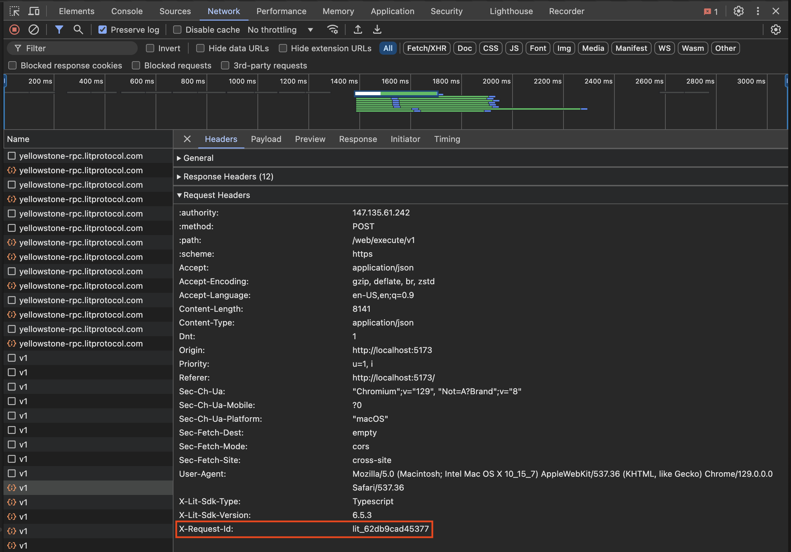

<!-- omit in toc -->
# Connecting to Lit

In order to interact with the Lit network, you need to instantiate an instance of the `LitNodeClient` and connect it to a Lit network.

This connection is what will allow you to make decryption and signing requests, as well as execute the decentralized serverless functions, Lit Actions.

<!-- omit in toc -->
## Table of Contents

- [Prerequisites](#prerequisites)
  - [Required Packages](#required-packages)
- [The Code Example](#the-code-example)
  - [Instantiating the `LitNodeClient`](#instantiating-the-litnodeclient)
    - [Setting A Storage Provider](#setting-a-storage-provider)
      - [Node.js Environment](#nodejs-environment)
      - [Browser Environment](#browser-environment)
  - [Connecting `LitNodeClient` to a Lit Network](#connecting-litnodeclient-to-a-lit-network)
  - [Disconnecting `LitNodeClient`](#disconnecting-litnodeclient)
- [Getting Support from the Lit Team](#getting-support-from-the-lit-team)
  - [Node.js Environment](#nodejs-environment-1)
  - [Browser Environment](#browser-environment-1)

## Prerequisites

- An understanding of the Lit's [core terminology](./overview#core-terminology)

### Required Packages

- `@lit-protocol/lit-node-client`
- `@lit-protocol/constants`

## The Code Example

:::note
A full implementation of the code covered in this guide is available [here](https://github.com/LIT-Protocol/developer-guides-code/tree/v2/getting-started/connecting-to-lit).
:::

```tsx
import { LitNodeClient } from '@lit-protocol/lit-node-client';
import { LitNetwork } from '@lit-protocol/constants';

export const runExample = async () => {
  let litNodeClient: LitNodeClient;

  try {
    litNodeClient = new LitNodeClient({
      litNetwork: LitNetwork.DatilDev,
      debug: true,
    });
    await litNodeClient.connect();
  } catch (error) {
    console.error(error);
  } finally {
    litNodeClient!.disconnect();
  }
};
```

### Instantiating the `LitNodeClient`

The `LitNodeClient` can be instantiated with [several options](https://v7-api-doc-lit-js-sdk.vercel.app/interfaces/types_src.LitNodeClientConfig.html), but the only required option is `litNetwork`.

`litNetwork` specifies which of the Lit networks you wish to connect to (Lit [Mainnets](../../learn/overview/how-it-works/lit-networks/mainnets) or [Testnets](../../learn/overview/how-it-works/lit-networks/testnets)). The `@lit-protocol/constants` package contains the `LitNetwork` constant which contains the past and present Lit networks as an `enum` so you don't have to remember the network names.

The additional `debug` option specified in the code example is optional, but setting it to `true` will provide additional logging which can be helpful for debugging. This flag will only provide debug logs when executing in a Node.js environment; In a browser environment, the `debug` flag will be ignored.

#### Setting A Storage Provider

##### Node.js Environment

While not required, and not used in this guide, the `storageProvider` option is used to configure where the Lit SDK will store data related to the [Lit Session](./overview#session-signatures).

When not provided, a new Session Keypair will be generated each time the `LitNodeClient` is initialized.


##### Browser Environment

In a browser environment, the `storageProvider` option will be ignored, and the Session Keypair will be stored in the browser's local storage.

To clear the cached Session Keypair, you can use the `disconnectWeb3` function (imported from the `@lit-protocol/auth-browser` package) like so:

```ts
import { LitNodeClient } from '@lit-protocol/lit-node-client';
import { LitNetwork } from '@lit-protocol/constants';
import { disconnectWeb3 } from "@lit-protocol/auth-browser";

let litNodeClient;
try {
  litNodeClient = new LitNodeClient({
      litNetwork: LitNetwork.DatilDev,
      debug: false,
  });

  await litNodeClient.connect();
} catch (error) {
  console.error(error);
} finally {
  disconnectWeb3(); // <--- When this function call is executed,
  // the Session Keypair will be deleted from the browser's local storage
  litNodeClient.disconnect();
}
```

### Connecting `LitNodeClient` to a Lit Network

Once instantiated, the `LitNodeClient` can be connected to a Lit network by calling the `connect()` method:

```tsx
await litNodeClient.connect();
```

This will establish a connection to the specified `litNetwork`, and will sync the required state for the Lit SDK such as the network's public BLS key.

### Disconnecting `LitNodeClient`

After you are finished interacting with the Lit network, you should disconnect the `LitNodeClient` by calling the `disconnect()` method:

```tsx
await litNodeClient.disconnect();
```

If you don't do this, depending on your execution environment, you may continue to have a JavaScript process running in the background which consumes network, CPU, and memory resources. Not a big deal for most applications, but it's always a good idea to clean up after your application has finished running.

## Getting Support from the Lit Team

If you encounter any issues, providing the Lit team with your Lit request ID can help us resolve the problem faster.

### Node.js Environment

In a Node.js environment, the request ID will be logged to the console when an error occurs. If this is not the case, you can enable debug logging by setting the `debug` flag to `true` in the `LitNodeClient` instance; the request ID will then be logged to the console.

The following is an example log from `LitNodeClient` when `debug` was set to `true`:

```
[Lit-JS-SDK v6.8.1] [2024-10-12T02:45:37.100Z] [DEBUG] [core] [id: a1eefc564ff6b] executeJs responseData from node
```

`[id: a1eefc564ff6b]` is the Lit request ID that you should provide to the Lit team when making a support request.

### Browser Environment

In a browser environment, the request ID will be logged to the console when an error occurs. If not, you can find the error in the **Network** tab of your browser's developer tools; scrolling to the bottom of the page will show the request ID.

The following is an example of a response to a request made using `LitNodeClient` in the browser:


