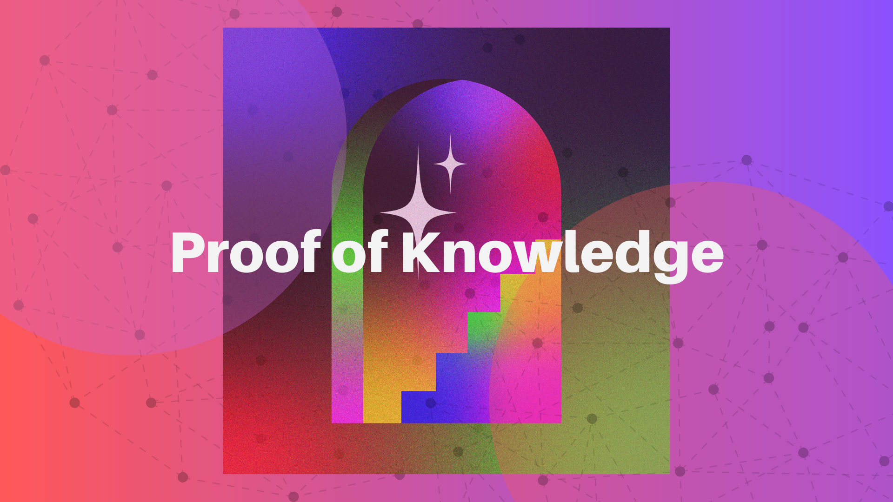

# Proof of Knowledge

Congratulations on completing this Intro to Lit Protocol lesson! Now it's time to put your newly acquired knowledge to the test and showcase your understanding of Lit.

## Test Your Knowledge

[Go to Gateway.xyz to complete this learning assessment!](https://www.mygateway.xyz/credential/6a945284-6d7f-4555-983e-4b31072645cf)

This quiz serves as a crucial step in solidifying your understanding and demonstrating your competence in understanding access control and programmatic signing. The quiz encompasses a range of questions that will challenge your comprehension of what you've read so far on key concepts, principles, and real-world applications of Lit.

By successfully completing the quiz, you will earn a Proof of Knowledge credential, validating your proficiency.

Take the plunge and test your knowledge today! Good luck and may your expertise shine through as you dive deeper into the world of decentralized tech.

---

## Continue Learning
- Check out the [Lit JS SDK](https://github.com/LIT-Protocol/js-sdk)
- Continue reading the [developer docs](https://developer.litprotocol.com/)
- Ask questions in the [Lit Discord](https://litgateway.com/discord)

Stay tuned for the codebreaker lessons that will require getting into code and building with Lit!

