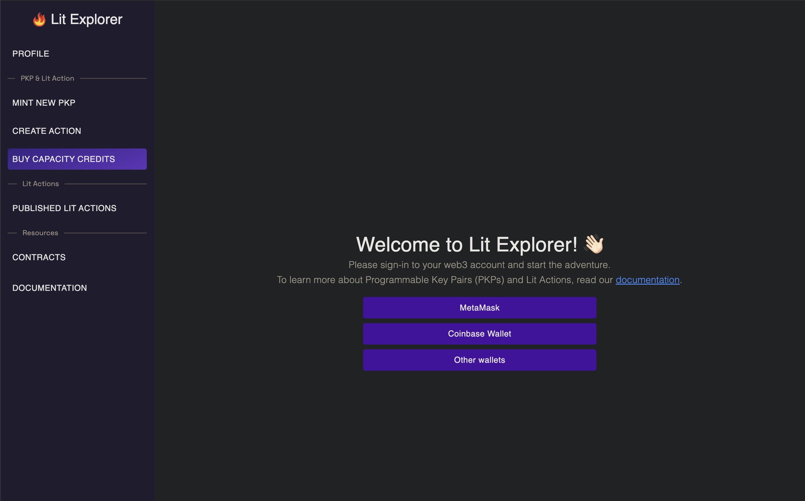
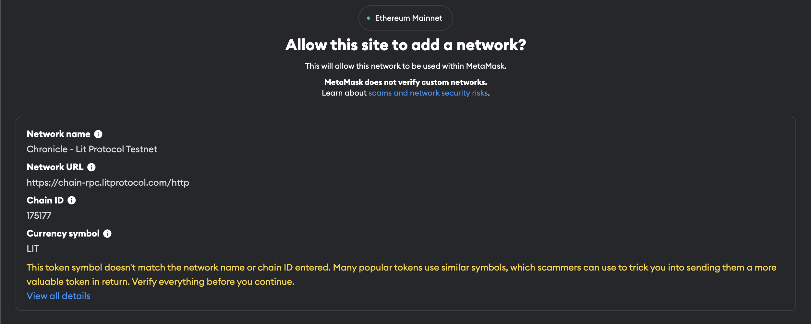
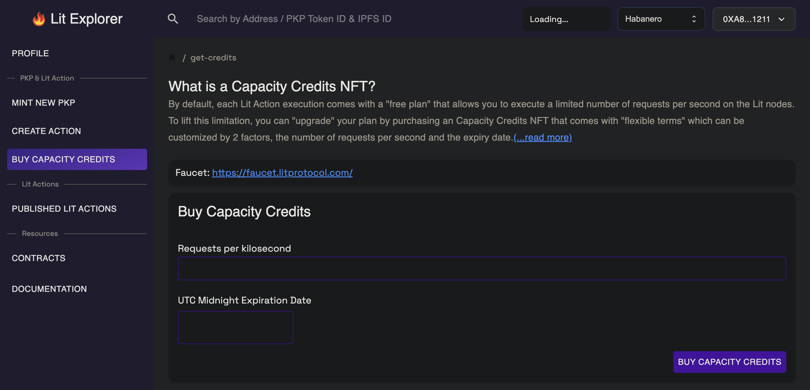
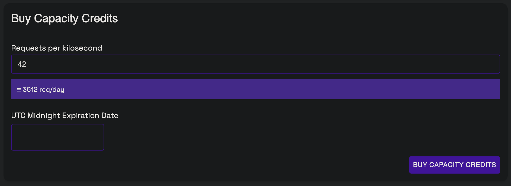
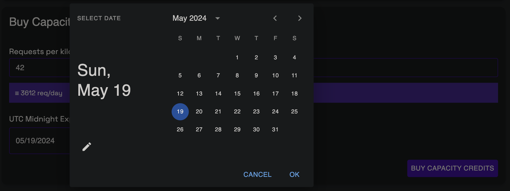
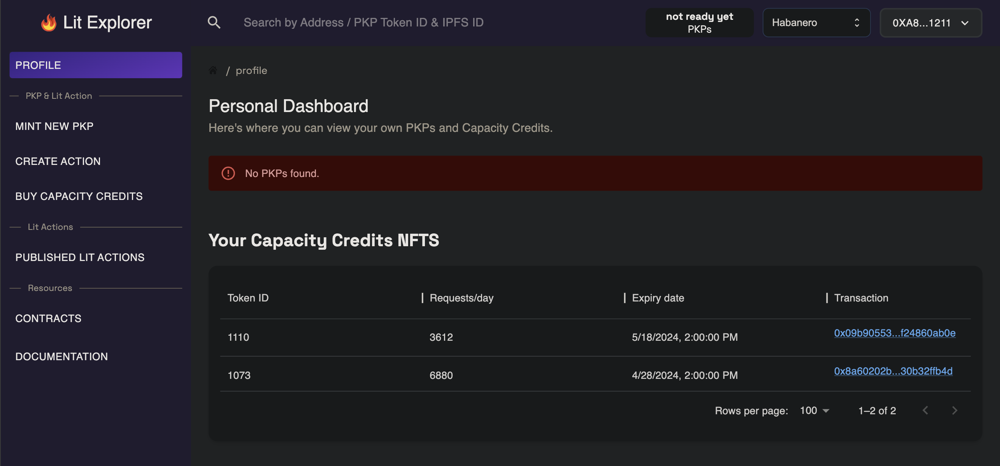

---
# Display h2 to h4 headings
toc_min_heading_level: 2
toc_max_heading_level: 5
---

import Tabs from '@theme/Tabs';
import TabItem from '@theme/TabItem';

# Paying for Lit

<!-- This guide should demonstrate how you (as an app developer) can pay for transactions on the Lit network using Capacity Credits. It should include info on:

Introduction: set relevant context. Which transaction types require capacity credits (versus just gas)

Setting up an 'payer' wallet

Minting capacity credits

Delegating capacity credits

Creating sessions from capacity credits

Using credits: 

Decryption

Signing with PKPs and Actions -->

:::info
Currently Rate Limiting is only enabled on `Habanero` and `Manzano`.
See [here](../network/networks/testnet) for a list of test networks.
See [here](../network/networks/mainnet) for a list of mainnet networks.
:::

## Overview

Like other decentralized networks, Lit has a certain amount of computation available for users that's metered to allow for a responsive network with nodes that are able to stay in-sync with one another.

In order to use Lit, you must reserve capacity on the network. This can be done by purchasing a Capacity Credit using the `testLPX` testnet token. The holders of a Capacity Credit reserve a configurable number of requests to the Lit network (measured in requests per day) over a fixed length of time (i.e. one week).

There are some transactions to Lit that require only gas be paid (via the `testLPX` testnet token), while other transactions require a Capacity Credit:

Transactions requiring only gas:

- Purchasing a Capacity Credit

Transactions requiring a Capacity Credit:

- Decryption requests to the Lit network
- Execution of Lit Actions

## The `LPX` Token

The `Habanero` and `Manzano` testnets are powered by Lit's custom EVM rollup, [Chronicle](../network/rollup.mdx), and utilize the `testLPX` token to pay the gas for transactions. `testLPX` is **only** a testnet token and has no real-world value. It's purpose is exclusively for testing and development on the Lit Protocol testnet.

In order to continue with this guide and pay for your usage of Lit going forward, you can obtain `testLPX` using our [faucet](https://faucet.litprotocol.com/). The `testLPX` test token will be sent to your wallet address, allowing you to perform transactions on the rollup.

## Capacity Credits

While the `testLPX` token is used to pay for your gas on Chronicle, Capacity Credits reserve resources for you to perform actions such as decrypting and utilizing [Programmable Key Pairs (PKPs)](../sdk/wallets/minting.md) on the Lit network.

The key concepts to understand about Capacity Credits are:

- Choosing a Payer wallet
- Minting a Capacity Credit
- Using a Capacity Credit to interact with Lit
- Delegating a Capacity Credit

### Choosing a Payer Wallet

Before you can mint a Capacity Credit, you'll need to decide what wallet will be the owner of the credit and pay for the minting transaction using `testLPX` on the testnet. The choice depends on what works best for your implementation, whether that be a standard [externally owned account](https://ethereum.org/en/developers/docs/accounts/#externally-owned-accounts-and-key-pairs), a smart contract wallet, or even a [Lit PKP](../sdk/wallets/minting).

Ideally, and for most production implementations, the Payer wallet is going to delegate their Capacity Credits to other wallets and/or PKPs to submit transaction to the Lit network. Not only does this keep the Payer wallet more secure, but as we'll cover in the [Delegating Capacity Credits](#delegating-capacity-credits) section, you can restrict the capabilities of each delegate to control what they're allowed to do with your Capacity Credit.

### Minting a Capacity Credit

Capacity Credits can be minted by:

- Using the [Lit Explorer](https://explorer.litprotocol.com/get-credits)
- Using the `@lit-protocol/contracts-sdk` package
  - [NPM Page](https://www.npmjs.com/package/@lit-protocol/contracts-sdk)
  - [Source Code](https://github.com/LIT-Protocol/js-sdk/tree/master/packages/contracts-sdk)

#### Using the Lit Explorer to Mint A Capacity Credit

If you're visiting the Lit Explorer for the first time, or are currently signed out, you'll see the following screen when you visit the [Buy Capacity Credits](https://explorer.litprotocol.com/get-credits) page:



Simply login with the wallet of your choice. If your wallet prompts you to add the Lit Chronicle testnet, go ahead and approve and switch the network in your wallet:



If you don't receive a prompt to add the Chronicle testnet to your wallet, you can manually add it using the [Chronicle network info](https://developer.litprotocol.com/v3/network/rollup#connecting-to-chronicle).

Once your wallet is connected, and you've switch to the Chronicle testnet, you should see the screen:



Capacity Credits allow you to utilize the Lit network to perform actions such as executing Lit Actions and decrypting data.

While required for decrypting data, Lit Actions have an available "free plan" that allows for a limited number of executions by the Lit network per second. However, in order to avoid your Lit Action from being rate limited, you should mint a Capacity Credit.

The first requirement for minting a Capacity Credit is to decide how many `Requests per kilosecond` you're allowing to be made using your credit. As you type a number into this input field, your input will be converted into how many requests per day your Capacity Credit will allow for:



After deciding on a number, the next step is setting the `UTC Midnight Expiration Date` for your credit:



Clicking the input field will open a date picker where you will select the day your Capacity Credit is set to expire at UTC midnight.

After you've specified the `Requests per kilosecond` and `UTC Midnight Expiration Date` for your credit, you can click the `BUY CAPACITY CREDITS` button which will prompt you to sign the minting transaction using your connected wallet.

After confirming the transaction, and allowing Chronicle to include it in a block, you should see the following for your minted Capacity Credit:


The `Token ID` is the identifier we will be passing along in your requests to the Lit network, so make note of it. If you ever need to see a list of minted Capacity Credits, you can visit the [Profile](https://explorer.litprotocol.com/profile) page:



#### Using the Lit SDK to Mint A Capacity Credit

:::info
For a quick reference of how to programmatically mint a Capacity Credit using the SDK, please refer to our [User Wallet Quick Start Guide](../sdk/wallets/quick-start#mint-capacity-credits-and-delegate-usage).
:::

##### Installing Dependencies

Our first step is to install the required dependencies:

- [@lit-protocol/lit-node-client](https://www.npmjs.com/package/@lit-protocol/lit-node-client)
  - This package is the core Lit SDK.
- [@lit-protocol/lit-auth-client](https://www.npmjs.com/package/@lit-protocol/lit-node-client)
  - This package is used to authorize with the Lit network for usage.
- [@lit-protocol/contracts-sdk](https://www.npmjs.com/package/@lit-protocol/contracts-sdk)
  - The package allows us to easily interact with the Capacity Credits contract.

:::info
The minimum version of Node supported when using the SDK is `v16.16.0` because of the need for the `webcrypto` library.
:::

<Tabs
defaultValue="yarn"
values={[
{label: 'Installing with Yarn', value: 'yarn'},
{label: 'Installing with NPM', value: 'npm'},
]}>
<TabItem value="yarn">

```
yarn add @lit-protocol/lit-node-client @lit-protocol/lit-auth-client @lit-protocol/contracts-sdk
```

</TabItem>

<TabItem value="npm">

```
npm install --save @lit-protocol/lit-node-client @lit-protocol/lit-auth-client @lit-protocol/contracts-sdk
```

</TabItem>
</Tabs>

##### Connecting the SDK to the Lit Network

After getting it installed, we're going to import the SDK, instantiate an instance of `LitNodeClient`, and connect it to the Lit `cayenne` testnet.

The below code is going to vary depending on whether your code is running client-side (e.g. within a browser), or server-side (e.g. within a Node.js environment), please make sure you're following along with the correct code for your execution environment:

<Tabs
defaultValue="client-side"
values={[
{label: 'For Client Side Usage', value: 'client-side'},
{label: 'For Server Side Usage', value: 'server-side'},
]}>
<TabItem value="client-side">

```js
import * as LitJsSdk from "@lit-protocol/lit-node-client";

const main = async () => {
    const litNodeClient = new LitJsSdk.LitNodeClient({
        litNetwork: 'cayenne',
    });
    await litNodeClient.connect();
}

main();
```

This code is pretty straightforward, we import the SDK, instantiate an instance of `LitNodeClient`, specify the `litNetwork` we want to connect our client to, and lastly we're calling `await litNodeClient.connect();` to connect our instance of `LitNodeClient` to the Lit `cayenne` network.

</TabItem>

<TabItem value="server-side">

```js
import * as LitJsSdk from "@lit-protocol/lit-node-client";

const main = async () => {
    const litNodeClient = new LitJsSdk.LitNodeClientNodeJs({
        alertWhenUnauthorized: false,
        litNetwork: 'habanero',
    });
    await litNodeClient.connect();
}

main();
```

This code is pretty straightforward, we import the SDK, instantiate an instance of `LitNodeClientNodeJs`, specify the `litNetwork` we want to connect our client to, and lastly we're calling `await litNodeClient.connect();` to connect our instance of `LitNodeClientNodeJs` to the Lit `cayenne` network.

`alertWhenUnauthorized` is set to `false` since we're executing server-side. If this were set to `true` or omitted, the SDK would try to show a JavaScript `alert()` when we try to use the SDK without first being authorized. However, regardless of what this property is set to, an exception will be thrown in this scenario.

</TabItem>
</Tabs>

##### Authenticating with the Lit Network

Now that the SDK is installed and we've got a `LitNodeClient` connected to the network, our next step is authenticate ourselves with the Lit network so we can begin making requests to it. To do this, we're going to make use of [Session Signatures](../sdk/authentication/session-sigs/intro):

<Tabs
defaultValue="siwe"
values={[
{label: 'Using SIWE', value: 'siwe'},
{label: 'Using Something Else', value: 'something-else'},
]}>
<TabItem value="siwe">
</TabItem>

<TabItem value="something-else">
</TabItem>
</Tabs>

### Delegating Capacity Credits

TODO
