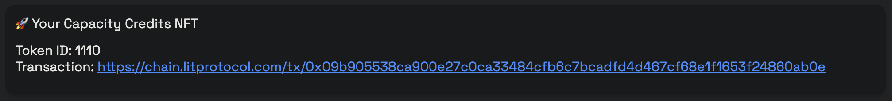

# Paying for Lit

<!-- This guide should demonstrate how you (as an app developer) can pay for transactions on the Lit network using Capacity Credits. It should include info on:

Introduction: set relevant context. Which transaction types require capacity credits (versus just gas)

Setting up an 'payer' wallet

Minting capacity credits

Delegating capacity credits

Creating sessions from capacity credits

Using credits: 

Decryption

Signing with PKPs and Actions -->

Like other decentralized networks, Lit has a certain amount of computation available for users that's metered to allow for a responsive network with nodes that are able to stay in-sync with one another. There are two key concepts to understand when it comes to paying for your transaction in Lit:

- The `LPX` token
- Capacity Credits

## The `LPX` Token

The `Habanero` and `Manzano` testnets are powered by Lit's custom EVM rollup, [Chronicle](../network/rollup.mdx), and utilize the `testLPX` token to pay the gas for transactions. `testLPX` is only a testnet token and has no real-world value. It's purpose is exclusively for testing and development on the Lit Protocol testnet.

In order to continue with this guide and pay for your usage of Lit going forward, you can obtain `testLPX` using our [faucet](https://faucet.litprotocol.com/). The `testLPX` test token will be sent to your wallet address, allowing you to perform transactions on the rollup.

## Capacity Credits

While the `testLPX` token is used to pay for your gas on Chronicle, Capacity Credits reserve resources for you to perform actions such as decrypting and utilizing [Programmable Key Pairs (PKPs)](../sdk/wallets/minting.md) on the Lit network.

The key concepts to understand about Capacity Credits are:

- Minting a Capacity Credit NFT
- Using a Capacity Credit to interact with Lit
- Delegating a Capacity Credit

### Minting a Capacity Credit NFT

Capacity Credits can be minted by:

- Using the [Lit Explorer](https://explorer.litprotocol.com/get-credits)
- Using the `@lit-protocol/contracts-sdk` package
  - [NPM Page](https://www.npmjs.com/package/@lit-protocol/contracts-sdk)
  - [Source Code](https://github.com/LIT-Protocol/js-sdk/tree/master/packages/contracts-sdk)

#### Using the Lit Explorer to Mint A Capacity Credit

If you're visiting the Lit Explorer for the first time, or are currently signed out, you'll see the following screen when you visit the [Buy Capacity Credits](https://explorer.litprotocol.com/get-credits) page:

Simply login with the wallet of your choice. If your wallet prompts you to add the Lit Chronicle testnet, go ahead and approve and switch the network in your wallet:

If you don't receive a prompt to add the Chronicle testnet to your wallet, you can manually add it using the [Chronicle network info](https://developer.litprotocol.com/v3/network/rollup#connecting-to-chronicle).

Once your wallet is connected, and you've switch to the Chronicle testnet, you should see the screen:

Capacity Credits allow you to utilize the Lit network to perform actions such as executing Lit Actions and decrypting data.

While required for decrypting data, Lit Actions have an available "free plan" that allows for a limited number of executions by the Lit network per second. However, in order to avoid your Lit Action from being rate limited, you should mint a Capacity Credit.

The first requirement for minting a Capacity Credit is to decide how many `Requests per kilosecond` you're allowing to be made using your credit. As you type a number into this input field, your input will be converted into how many requests per day your Capacity Credit will allow for:

After deciding on a number, the next step is setting the `UTC Midnight Expiration Date` for your credit:

Clicking the input field will open a date picker where you will select the day your Capacity Credit is set to expire at UTC midnight.

After you've specified the `Requests per kilosecond` and `UTC Midnight Expiration Date` for your credit, you can click the `BUY CAPACITY CREDITS` button which will prompt you to sign the minting transaction using your connected wallet.

After confirming the transaction, and allowing Chronicle to include it in a block, you should see the following for your minted Capacity Credit:

The `Token ID` is the identifier we will be passing along in your requests to the Lit network, so make note of it. If you ever need to see a list of minted Capacity Credits, you can visit the [Profile](https://explorer.litprotocol.com/profile) page:

