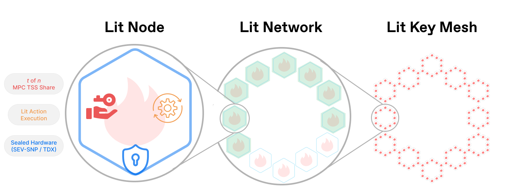

# Node Architecture

Each Lit Protocol Node starts with a sealed encrypted virtual machine (otherwise known as a Trusted Execution Environment (TEE)) running on an independently operated server. The use of the TEE guarantees that all signing, encryption, and Lit Action execution requests are processed securely, without exposing sensitive key material to node operators or end users consuming the services provided by Lit Protocol. Each time you connect to the Lit network, you do an attestation handshake with each of the nodes. The Lit SDK automatically checks this attestation against certificates provided by AMD (the secure hardware utilized by Lit is AMD’s SEV-SNP), and also checks the details of the attestation report to verify that the node is genuine and running the correct version of the code.

Within the sealed hardware, each Lit node contains a JavaScript execution environment ([Deno](https://deno.com/)) and any given number of key shares. Each key share corresponds to a key pair that is generated collectively by all participating nodes using a process called distributed key generation (DKG).
